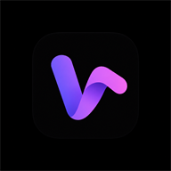

<div align="center">
  

  <h1>VYBE Music</h1>

  <p><b>A modern Android music streaming powerhouse by TERON TECH (IT Sector) & ABC Reddy with ad-free playback, real-time synchronized lyrics, offline downloads, Listen Together sync, and custom ambient UI.</b></p>

  <p>
    <a href="LICENSE"></a>
    <a href="https://github.com/terontech-it/VYBE-MUSIC/releases"></a>
    
    <a href="https://github.com/terontech-it"></a>
  </p>

  <p>Developed by <b>TERON TECH</b> & <b>ABC Reddy</b> (<a href="https://www.instagram.com/reddy_abcr_/?hl=en">@reddy_abcr_</a>)</p>
</div>

---

## 🏢 About TERON TECH & VYBE Music

**VYBE Music** is developed and maintained by **TERON TECH** (IT Sector) in collaboration with Lead Developer **ABC Reddy**.

Built with modern Android standards (**Kotlin**, **Jetpack Compose**, **Material 3 / Material You**, **Media3 / ExoPlayer**, and **Room Database**), VYBE is engineered to provide an ad-free, high-fidelity music streaming and synchronization platform.

---

### 📌 Project Metadata
- **Organization / Startup**: **TERON TECH** (IT Sector)
- **Official Repository**: [https://github.com/terontech-it/VYBE-MUSIC](https://github.com/terontech-it/VYBE-MUSIC)
- **Lead Developer**: ABC Reddy
- **Contributors**: TERON TECH, ABC Reddy
- **Developer Instagram**: [@reddy_abcr_](https://www.instagram.com/reddy_abcr_/?hl=en)
- **License**: [GNU General Public License v3.0 (GPL-3.0)](LICENSE)
- **Support / Buy Me a Coffee (UPI)**: `reddyabcr07@ybl` (PhonePe, Google Pay, Paytm)

---

## Table of Contents

- [Overview](#overview)
- [Features](#features)
- [Support the Developer](#support-the-developer)
- [Installation & Setup](#installation--setup)
- [Special Thanks](#special-thanks)
- [Legal Disclaimer & Terms of Use](#legal-disclaimer--terms-of-use)

---

## ✨ Features & Visual Highlights

### 📲 Recap & Social Stories
- **Interactive 10-Slide Recap** — Weekly and monthly listening journeys with listening hours, top artist, persona, and peak listening days.
- **Save as 9:16 Story Image** — Export high-resolution 1080x1920 Google-styled story cards with one tap to share directly on Instagram Stories and WhatsApp.
- **Seasonal Themes** — Dynamically adapts color palettes based on the season (*Winter Chill*, *Spring Groove*, *Summer Vybe*, *Autumn Warmth*).

### 👥 Listen Together with Live Reactions
- **Real-Time Synchronized Playback** — Host listening rooms with low-latency websocket synchronization.
- **Floating Emoji Reactions** — Tap live emoji reactions (🔥, ❤️, 👏, ⚡, 💃) that float and sway upwards on everyone's screen in real time.
- **Live Room Comments** — Chat with room participants with message replies.

### 🎨 Ambient Canvas & UI Polish
- **Dynamic Mesh & Glow Backgrounds** — Ambient canvas backgrounds extracting colors from the current album art (*Live Mesh*, *Glow Animated*, *Apple Music Fluid*, and *Liquid Glass*).
- **Smart Sleep Timer with 30s Fade-Out** — Gradually and gently tapers audio volume down over 30 seconds before pausing so you drift off peacefully.
- **Offline Ready Badges** — Clear visual badges indicating cached and downloaded tracks ready for internet-free playback.
- **Home Speed Dial & Fresh Recommendations** — 3x3 Speed Dial with randomized dice roll recommendation shuffle.

### ⚙️ Smart Playback & Quality
- **Ad-Free Streaming** — Seamless playback without ads or promotional interruptions.
- **Word-by-Word Synchronized Lyrics** — Real-time lyrics with karaoke-style letter-by-letter highlights.
- **Silence Skipping & Normalization** — Skip silence instantly and normalize track loudness with built-in ReplayGain.
- **Import from Spotify** — Connect and mirror your favorite Spotify playlists into local playlists.

---

## Support the Developer

If you enjoy using VYBE, consider supporting the development:

- **Buy Me a Coffee (UPI)**: `reddyabcr07@ybl`
- Supported via PhonePe, Google Pay, Paytm, or any UPI app.

---

## Installation & Setup

### Android Installation

Install the pre-compiled universal APK on your Android device (Android 7.0+).

<details>
<summary><b>Building from Source</b></summary>
<br>

1. **Configure Android SDK**
   Create a `local.properties` file in the project root:

   ```bash
   sdk.dir=/path/to/your/android/sdk
   ```

2. **Build the Application**

   To build the Universal Debug APK:
   ```bash
   ./gradlew assembleUniversalFossDebug
   ```

   The generated APK will be located at:
   `app/build/outputs/apk/universalFoss/debug/app-universal-foss-debug.apk`

</details>

---

## Special Thanks

VYBE is built upon foundational open-source music streaming architectures and libraries. Sincere thanks to the open-source community:

| Project | Description |
| :--- | :--- |
| **[Metrolist](https://github.com/MetrolistGroup/Metrolist)** & **[Vivi Music](https://github.com/vivizzz007/vivi-music)** | Foundational inspiration and architecture reference |
| **[ArchiveTune](https://github.com/koiverse/ArchiveTune)** | Material You UI inspiration |
| **[Better Lyrics](https://better-lyrics.boidu.dev/)** | Lyrics enhancement and synchronization |
| **[SimpMusic](https://github.com/maxrave-dev/SimpMusic)** | Lyrics implementation reference |
| **[Music Recognizer](https://github.com/aleksey-saenko/MusicRecognizer)** | Audio recognition engine |
| **[BravePipe](https://github.com/bravepipeproject/BravePipe)** | Decryption handling and backup playback engine |

---

## Legal Disclaimer & Terms of Use

### 1. 100% Free, Open-Source & Strictly Non-Commercial
VYBE is an open-source project (FOSS) created for educational and personal use. It is free, contains no ads, subscriptions, or paywalls.

### 2. Custom Client with Public APIs
VYBE acts as a custom client and browser interface parsing publicly accessible media content and metadata from YouTube and YouTube Music.

### 3. Support Content Creators
We strongly encourage supporting content creators and artists directly by subscribing to official premium subscriptions and streaming services.

---

<div align="center">
  <p>Licensed under <a href="LICENSE">GPL-3.0</a></p>
</div>
